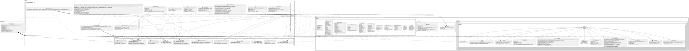
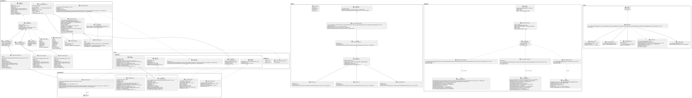

# SorriDent

Um assistente autonômo e plataforma web de teleatendimento para clinicas ortodônticas desenvolvido para o consultorio ortodôntico Dra. Mônica.

Projeto Integrador da UNICAP, Recife, Pernambuco.

| Disciplina | Professor | Turno | Turma | Período |
|---|---|---|---|---|
|Projeto Integrador|Jheymesson Apolinario Cavalcanti|Manhã|MINF-0205| 2026.2|

|Alunos|
|---|
|Salomão de Moraes|
|Marcel Guinhos|
|Lucas Dias|
|João Pedro|

A lista completa em `CONTRIBUIDORES.txt`.

## Sobre

O SorriDent é um sistema de atendimento automático para consultórios
odontológicos. Ele usa um agente com inteligência artificial que conversa
com o paciente pelo WhatsApp e pelo portal web, organiza consultas, responde
as dúvidas mais comuns e chama uma pessoa quando não consegue resolver.

O atendimento usa a agenda real dos dentistas, então só oferece horários que
estão realmente livres. O paciente pode marcar, remarcar e cancelar uma
consulta, receber um lembrete antes do dia e falar com a equipe quando
precisar. Tudo isso sem depender da recepção, que ganha um painel para
acompanhar a fila de pendências e ver o histórico de cada conversa.

## Utilidade

O agente agenda, remarca e cancela consultas. Ele tira dúvidas frequentes,
como preços, formas de pagamento e endereço. Ele envia lembretes e guarda o
histórico dos atendimentos. Quando não consegue atender, transfere o
paciente para uma pessoa, mantendo o contexto da conversa.

O sistema também monta relatórios diários e envia por e-mail. A equipe
acompanha tudo por um painel na web, que mostra a agenda, os pacientes, os
atendimentos pendentes e a base de conhecimento.

## Passos de instalação

### Requisitos

Para rodar o projeto você precisa de:
- Git
- Python 3.12 ou mais novo
- Node.js 18.17 ou mais novo (recomendado o 20, via nvm)
- npm (vem junto com o Node.js)
- make

O Node.js é usado só na interface web. O backend é todo em Python.

### Instalando o Node.js com o nvm

O nvm (Node Version Manager) deixa você ter várias versões do Node.js ao
mesmo tempo. Para instalar, abra um terminal e rode:

```bash
curl -o- https://raw.githubusercontent.com/nvm-sh/nvm/v0.40.1/install.sh | bash
```

Depois recarregue o terminal e instale a versão estável:

```bash
nvm install 20
nvm use 20
npm install -g npm@latest
```

Confirme que o Node está instalado e qual é a versão:

```bash
node --version
npm --version
```

### Linux (Ubuntu ou Debian)

Primeiro instale o Python e o git, caso ainda não tenha:

```bash
sudo apt update
sudo apt install -y python3 python3-venv python3-pip git
```

Entre na pasta do projeto e crie o ambiente virtual do Python:

```bash
cd sorrident
python3 -m venv .venv
```

Ative o ambiente e instale as dependências do backend:

```bash
source .venv/bin/activate
pip install -r requirements.txt
```

Configure a chave do provedor de IA. Sem ela o agente não responde. Você
pode usar a chave do Groq Cloud:

```bash
export GROQ_CLOUD_API_KEY="sua-chave"
```

Subindo o backend (API e bot), com o script da raiz:

```bash
./run_backend.sh
```

Em outro terminal, suba a interface web. O script já instala as
dependências do frontend na primeira vez:

```bash
./run_frontend.sh
```

A API fica em `http://localhost:8000` e a interface em
`http://localhost:3000`. A documentação interativa da API fica em
`http://localhost:8000/docs`.

### Windows (com WSL2)

O WSL2 é um ambiente Linux que roda dentro do Windows. Ele é a forma mais
simples de rodar este projeto no Windows, porque os scripts e as
dependências foram feitos para Linux.

Para instalar, abra o PowerShell como administrador e rode:

```powershell
wsl --install -d Ubuntu
```

Reinicie o computador quando o Windows pedir. Ao abrir o Ubuntu, ele pede
para criar um usuário e uma senha. Depois, dentro do Ubuntu:

```bash
sudo apt update
sudo apt install -y python3 python3-venv python3-pip git curl
```

Instale o nvm e o Node.js como na seção anterior. Continue com a
instalação do Python, a criação do ambiente virtual e a chave do provedor.
Por fim suba o backend e o frontend:

```bash
./run_backend.sh
./run_frontend.sh
```

O site que está rodando dentro do WSL2 pode ser aberto no navegador do
Windows pelo mesmo endereço `http://localhost:3000`.

## Detalhes da Arquitetura de Software

O projeto segue a arquitetura limpa. As dependências apontam sempre para
dentro, e cada parte conhece apenas os contratos do núcleo, nunca as
versões concretas. Isso deixa o código mais fácil de entender e de testar.

A visão geral dos diagramas está abaixo, e a explicação detalhada de cada
parte está no arquivo `docs/projeto.md`, junto com os outros diagramas.

### Os modelos de domínio

Aqui estão as entidades do negócio: o paciente, o dentista, os
procedimentos, as consultas e as conversas. Também ficam aqui as listas de
valores que dão sentido aos campos, como o status da consulta e o tipo de
canal.

[](docs/uml/svg/domain_models.svg)

### Os contratos do núcleo

Estes são os contratos que o sistema inteiro enxerga: a base de dados, o
repositório, o provedor de IA, as ferramentas, o agente, o canal de
mensagem e a fila de eventos. Eles definem como cada parte se comporta sem
dizer como ela é construída.

[](docs/uml/svg/core_interfaces.svg)

### O agente de IA

Esta é a parte que conversa com o paciente. O agente usa as ferramentas uma
a uma, sempre passando pelo provedor de IA. Ele administra a memória da
conversa para não crescer demais e acompanha cada tarefa que executa.

[](docs/uml/svg/agent.svg)

### Serviços e repositórios

Esta camada cuida dos casos de uso. Os serviços cumprem o que a interface
pede e usam os repositórios para guardar e buscar os dados do domínio.

[](docs/uml/svg/services_repositories.svg)

### Os canais de mensagem

Esta parte cuida de onde a mensagem chega. Há uma página web, e também
integração com o Telegram e com o WhatsApp. O agente recebe a mensagem de
qualquer um desses canais e responde de volta no mesmo lugar.

[](docs/uml/svg/channels.svg)

### A base de conhecimento

Para responder sem inventar, o agente consulta uma base de conhecimento.
O texto é dividido em pedaços, transformado em números e guardado na
memória. Dois buscadores trabalham juntos: um encontra a palavra exata e o
outro encontra o sentido parecido.

[](docs/uml/svg/rag.svg)

### Infraestrutura, integrações e tarefas

Aqui estão as versões concretas dos contratos do núcleo: o banco de dados,
as credenciais, a fila de eventos e o provedor de IA. Também ficam aqui as
integrações com serviços de fora, os exportadores de conversa e os
trabalhos que rodam de tempos em tempos, como os lembretes.

[](docs/uml/svg/infrastructure.svg)

### A API REST

A API expõe o sistema para o portal web. Uma fábrica monta o servidor com
as rotas, e um verificador de acesso garante quem pode entrar em cada
recurso. As rotas dependem apenas das interfaces de serviço.

[](docs/uml/svg/api.svg)

## Licença

Este projeto possui uma licença proprietária. Leia o arquivo `LICENSE.md`
para entender o que pode e o que não pode ser feito com o código.

---

2026.2 - UNICAP - RECIFE