# SorriDent

Um assistente autonômo e plataforma web de teleatendimento para clinicas ortodônticas desenvolvido para o consultorio ortodôntico Dra. Mônica.

<p align="center">
  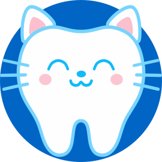
</p>

<h2 align="center">SorriDent</h2>

<p align="center">
  <em>Marca consulta, tira dúvida e chama a equipe quando precisa.</em>
</p>

Projeto Integrador da UNICAP, Recife, Pernambuco.

| Disciplina | Professor | Turno | Turma | Período |
|---|---|---|---|---|
|Projeto Integrador|Jheymesson Apolinario Cavalcanti|Manhã|MINF-0205| 2026.2|

|Alunos|
|---|
|Salomão de Moraes|
|Marcel Guinhos|
|Lucas Dias|
|João Pedro|

A lista completa em `CONTRIBUIDORES.txt`.

## Sobre

O SorriDent é um sistema de atendimento automático para consultórios
odontológicos. Ele usa um agente com inteligência artificial que conversa
com o paciente pelo WhatsApp e pelo portal web, organiza consultas, responde
as dúvidas mais comuns e chama uma pessoa quando não consegue resolver.

O atendimento usa a agenda real dos dentistas, então só oferece horários que
estão realmente livres. O paciente pode marcar, remarcar e cancelar uma
consulta, receber um lembrete antes do dia e falar com a equipe quando
precisar. Tudo isso sem depender da recepção, que ganha um painel para
acompanhar a fila de pendências e ver o histórico de cada conversa.

## Utilidade

O agente agenda, remarca e cancela consultas. Ele tira dúvidas frequentes,
como preços, formas de pagamento e endereço. Ele envia lembretes e guarda o
histórico dos atendimentos. Quando não consegue atender, transfere o
paciente para uma pessoa, mantendo o contexto da conversa.

O sistema também monta relatórios diários e envia por e-mail. A equipe
acompanha tudo por um painel na web, que mostra a agenda, os pacientes, os
atendimentos pendentes e a base de conhecimento.

## Passos de instalação

| Você precisa de | Para quê |
|---|---|
| Python 3.12+ | o backend |
| Node.js 20 | a interface web |
| Git e make | baixar e montar o projeto |

### Linux (ou Windows com WSL2)

```bash
# 1. dependências do sistema
sudo apt update && sudo apt install -y python3 python3-venv python3-pip git

# 2. ambiente do Python e bibliotecas
cd sorrident
python3 -m venv .venv
source .venv/bin/activate
pip install -r requirements.txt

# 3. a chave da IA, sem ela o agente não responde
export GROQ_CLOUD_API_KEY="sua-chave"
```

Agora é só subir, cada um em um terminal:

```bash
./run_backend.sh    # API e bot   -> http://localhost:8000
./run_frontend.sh   # interface   -> http://localhost:3000
```

A documentação da API fica em `http://localhost:8000/docs`.

<details>
<summary><b>Não tem o Node.js?</b></summary>

O nvm deixa você ter várias versões do Node ao mesmo tempo:

```bash
curl -o- https://raw.githubusercontent.com/nvm-sh/nvm/v0.40.1/install.sh | bash
# feche e abra o terminal
nvm install 20 && nvm use 20
node --version
```

</details>

<details>
<summary><b>Está no Windows?</b></summary>

O WSL2 é um Linux que roda dentro do Windows, e é o jeito mais simples de
usar o projeto, porque os scripts foram feitos para Linux.

No PowerShell como administrador:

```powershell
wsl --install -d Ubuntu
```

Reinicie o computador, abra o Ubuntu, crie seu usuário e siga os passos do
Linux normalmente. O site abre no navegador do Windows pelo mesmo endereço,
`http://localhost:3000`.

</details>

## Detalhes da Arquitetura de Software

O projeto segue a arquitetura limpa. As dependências apontam sempre para
dentro, e cada parte conhece apenas os contratos do núcleo, nunca as
versões concretas. Isso deixa o código mais fácil de entender e de testar.

Abaixo vem uma visão geral. A explicação detalhada de cada parte está no
arquivo `docs/projeto.md`, com todos os diagramas.

### Como as camadas se encaixam

Antes de olhar classe por classe, vale entender o desenho geral. O
núcleo fica no meio, com as regras do negócio, e não depende de nada: nem
de banco, nem de internet, nem de framework. Quem está em volta é que
depende dele. Por isso dá para trocar o Telegram, o banco ou o modelo de
IA sem mexer nas regras.

[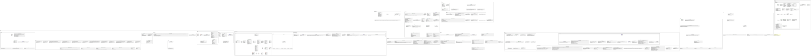](docs/uml/svg/projeto.svg)

### Os modelos de domínio

Aqui estão as entidades do negócio: o paciente, o dentista, os
procedimentos, as consultas e as conversas. Também ficam aqui as listas de
valores que dão sentido aos campos, como o status da consulta, o tipo de
horário (normal ou encaixe) e o tipo de canal.

[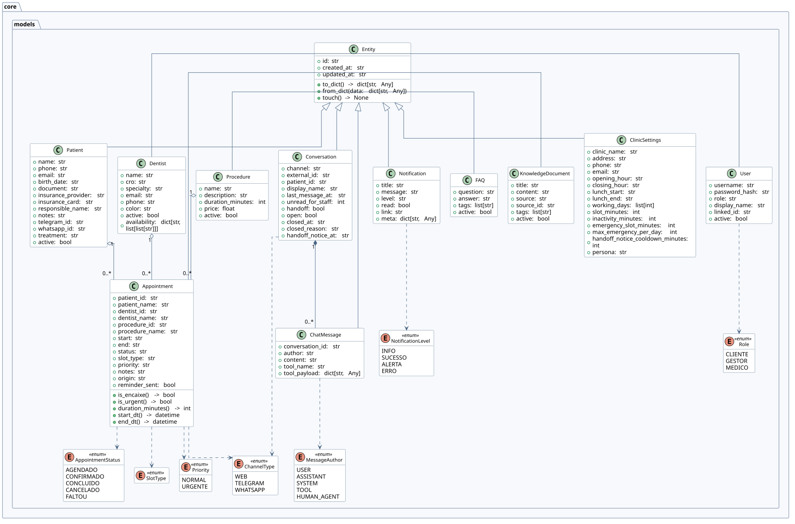](docs/uml/svg/domain_models.svg)

### Os contratos do núcleo

Estes são os contratos que o sistema inteiro enxerga: a base de dados, o
repositório, o provedor de IA, as ferramentas, o agente, o canal de
mensagem e a fila de eventos. Eles definem como cada parte se comporta sem
dizer como ela é construída.

[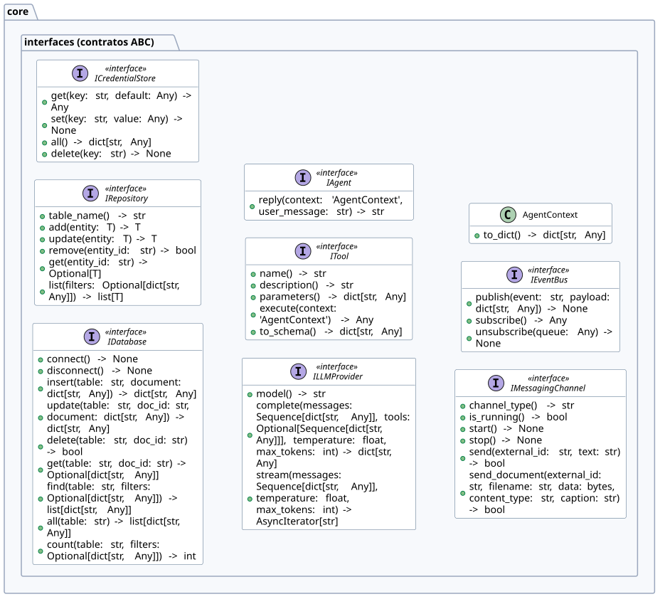](docs/uml/svg/core_interfaces.svg)

### O agente de IA

Esta é a parte que conversa com o paciente. O agente usa as ferramentas uma
a uma, sempre passando pelo provedor de IA. O diagrama mostra o laço do
agente, o montador do prompt e a base das ferramentas.

[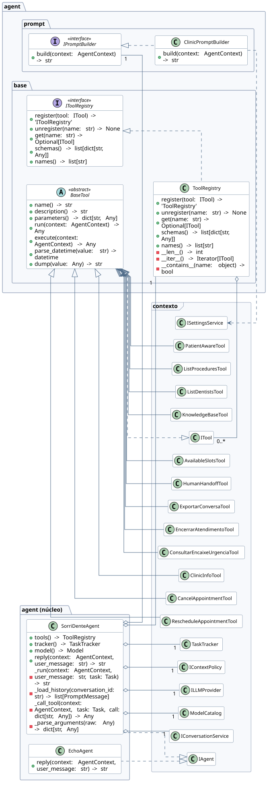](docs/uml/svg/agent.svg)

### A memória da conversa

O agente precisa lembrar do que já foi dito, mas sem deixar a conversa
crescer sem limite. A janela deslizante corta as mensagens antigas e o
limite de tokens respeita o tamanho que o modelo aguenta. Cada resposta
vira uma tarefa, com uma subtarefa por ferramenta chamada.

[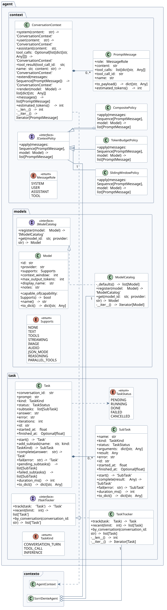](docs/uml/svg/agent_contexto.svg)

### As ferramentas do agente

É o que o agente sabe fazer, separado por assunto: cadastro do paciente,
agenda (com o encaixe de urgência), consulta à base de conhecimento e
suporte, como chamar um atendente ou exportar a conversa.

[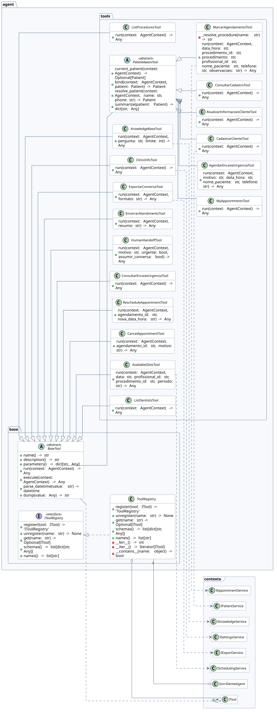](docs/uml/svg/agent_ferramentas.svg)

### Os serviços

Esta camada cuida dos casos de uso: marcar consulta, cadastrar paciente,
avisar a equipe. Cada serviço cumpre o que a interface pede e não sabe como
os dados são guardados.

[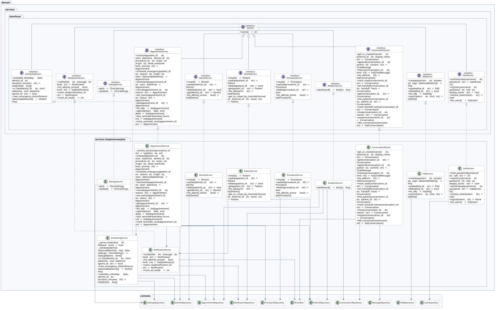](docs/uml/svg/servicos.svg)

### Os repositórios

Quem conversa com o banco. Cada repositório estende o repositório genérico
e soma as consultas próprias, guardando as entidades do domínio.

[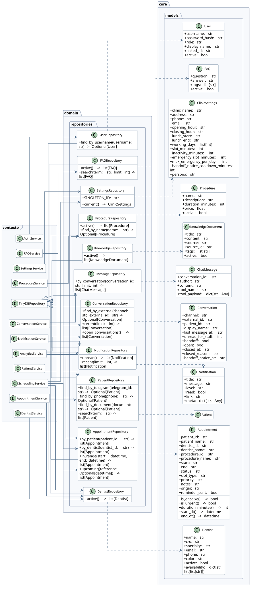](docs/uml/svg/repositorios.svg)

### Os canais de mensagem

Esta parte cuida de onde a mensagem chega. Há uma página web, e também
integração com o Telegram e com o WhatsApp. O agente recebe a mensagem de
qualquer um desses canais e responde de volta no mesmo lugar.

[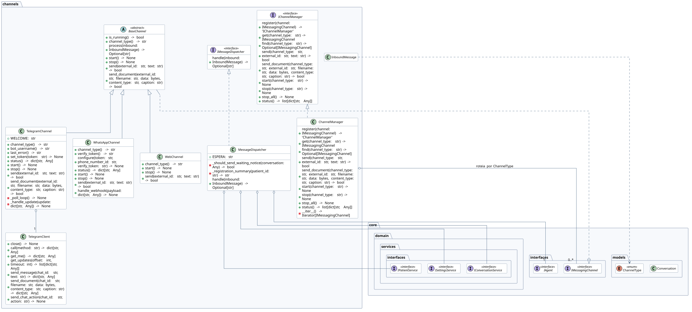](docs/uml/svg/channels.svg)

### A base de conhecimento

Para responder sem inventar, o agente consulta uma base de conhecimento.
O texto é dividido em pedaços, transformado em números e guardado na
memória. Dois buscadores trabalham juntos: um encontra a palavra exata e o
outro encontra o sentido parecido.

[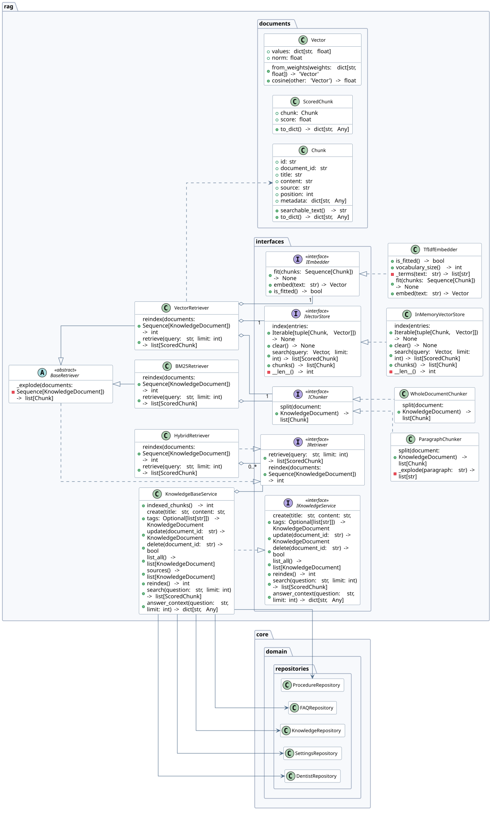](docs/uml/svg/rag.svg)

### A infraestrutura

Aqui estão as versões concretas dos contratos do núcleo: o banco de dados
(o pacote em forma de cilindro), as credenciais, a fila de eventos, o
provedor de IA da Groq (a nuvem, porque é um serviço de fora), a carga
inicial de dados e os trabalhos que rodam de tempos em tempos, como os
lembretes de consulta.

[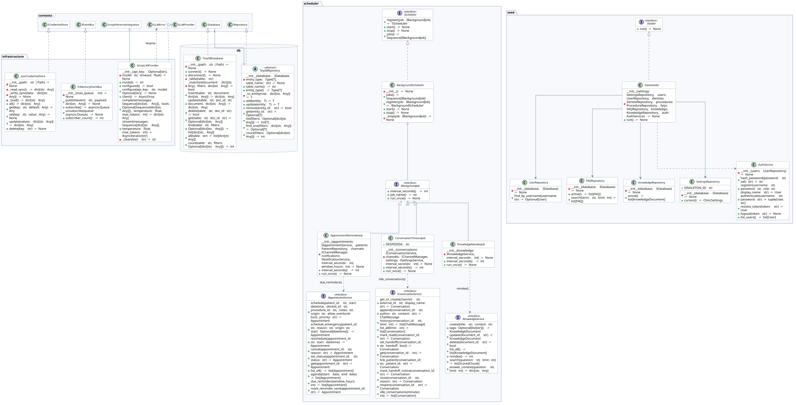](docs/uml/svg/infraestrutura.svg)

### As integrações e a exportação

A camada de integrações trata provedores de IA e canais do mesmo jeito:
cada um declara quais credenciais precisa, e a interface web monta o
formulário sozinha a partir disso. Trocar de IA não mexe no agente. Aqui
estão também os exportadores de conversa.

[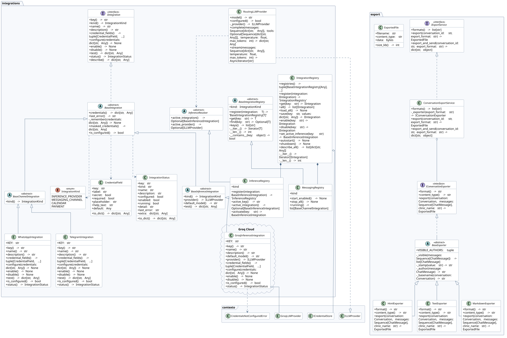](docs/uml/svg/integracoes.svg)

### A API REST

A API expõe o sistema para o portal web. Uma fábrica monta o servidor com
as rotas, e um verificador de acesso garante quem pode entrar em cada
recurso. As rotas dependem apenas das interfaces de serviço.

[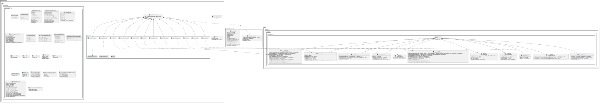](docs/uml/svg/api.svg)

### Gerando os diagramas

Os fontes ficam em `docs/uml/src/` e viram imagem com o PlantUML rodando em
Docker:

```bash
cd docs/uml
make all
```

Como editar os desenhos, o que cada script faz e quando usar cada tipo de
seta está no `docs/uml/README.md`.

## Licença

Este projeto possui uma licença proprietária. Leia o arquivo `LICENSE.md`
para entender o que pode e o que não pode ser feito com o código.

---

2026.2 - UNICAP - RECIFE